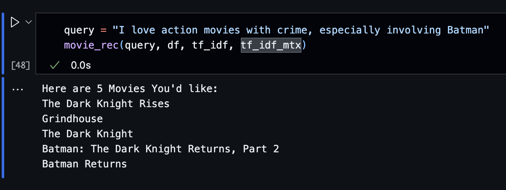

# Content-Based Movie Recommender System

#### Demo Video:
[YouTube Video](https://youtu.be/_6ISeu_XY6w)

#### Dataset: 
<ul>
<li>
[Kaggle's TMDB 5000 Movie Dataset](https://www.kaggle.com/datasets/tmdb/tmdb-movie-metadata?resource=download)
</li>
<li> Dataset is already stored in data folder and properly loaded in notebook, no steps required. </li>
</ul>

#### Setup:
<ul>
<li> Python Version: <b>3.12.7</b>
<li> 

In the project directory, run `python -m venv myenv` in terminal. 
<li> Run the next command depending on your OS:
<ul>

<li>

Windows: `myenv\Scripts\activate` 
</li>

<li>

Mac/Linux: `source myenv/bin/activate` 
</li>
</li>
</ul>
<li> 

Install dependencies: `pip install -r requirements.txt`
</li>
</ul>

#### Code:
<ul><li>

To run the code, open `main.ipynb` and run all. 
</li>
<li> 

If you'd like to experiment with the query, scroll to the very bottom and change the `query` variable value to your desired query, then run the cell. 
</li>
</ul>

#### Results:
